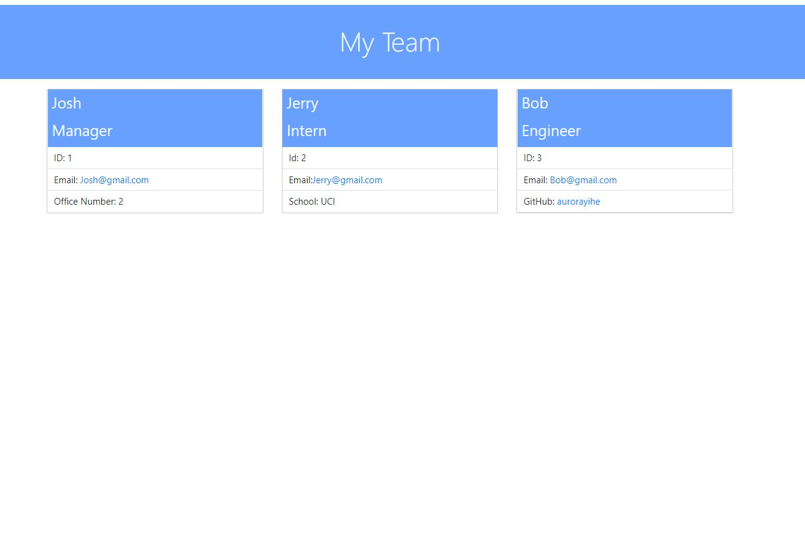

Module 10 - Team Profile Generator

## Project Description
In this project, I created a team profile generator to store team info.

## Usage
User starts the application by running command 'node index.js' in Git Bash/Terminal.

## Test
There are tests for each individual roles. Each role should contain the information 'name, id, email'. Some roles have their special properties. The test files are stored in folder _test_.

## Mock Application Function

## Test 

## Screenshot of the sample page

